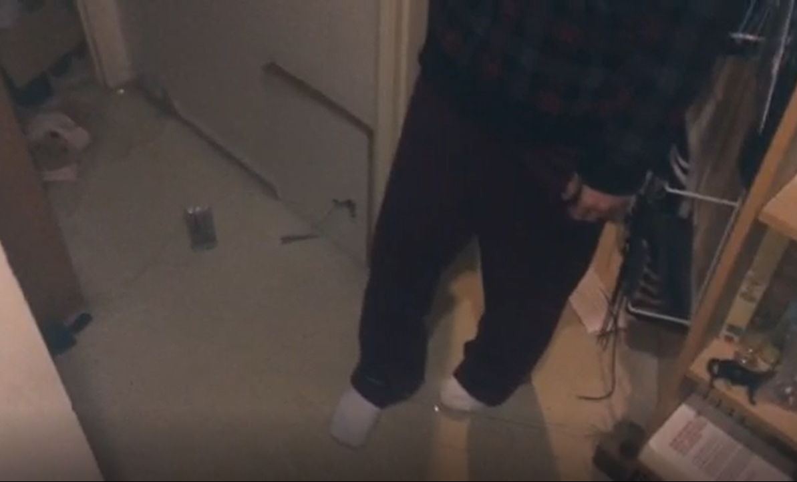

# Tripwire alarm
## Benjamin Davis ##
## 1701QCA Making Interaction 2020 Final Project ##

This project is a simple tripwire that, when tripped, sounds an alarm with flashing lights. The tripwires novelty comes from the unique way it is set up. The wire is tied around a brick, suspended across the doorway and thread through a hook, drilled into a second brick. The wire is then hooked around another hook drilled into the wall above. On the other end of the wire is a piece of metal. the microbit will be set up and two wires, that are part of a basic circuit, will be stuck into two peices of tin foil, wrapped around oppisite ends of a piece of cardboard. the piece of metal on the wire is placed onto the piece of cardboard, so that it closes the circuit and a weight will be placed on top of the metal to keep the wire taut. The way it's set up is also important to the effectiveness of the practicle joke. the way it's set up is fairly complex, so only the person who set it up would be able to easily know how to set it up, and since it is triggered by not detecting a current, the only way to deactivate it is too set it up or cut the power completely. This leaves whoever trips the wire stuck with an annoying noise for as long as it takes for them to figure out how to stop it or untill the person who set the trap finds out.

### Journal ###

[Process and reflection journal](/journal/journal.md)
