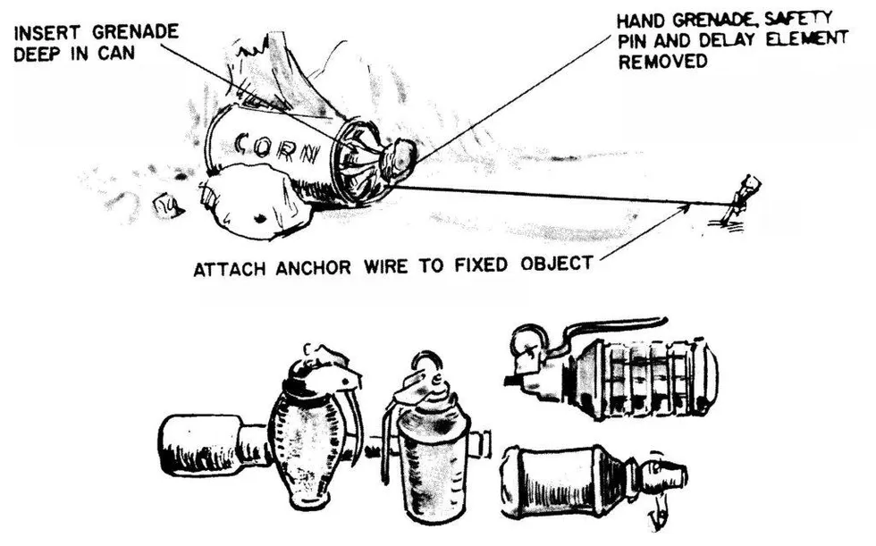
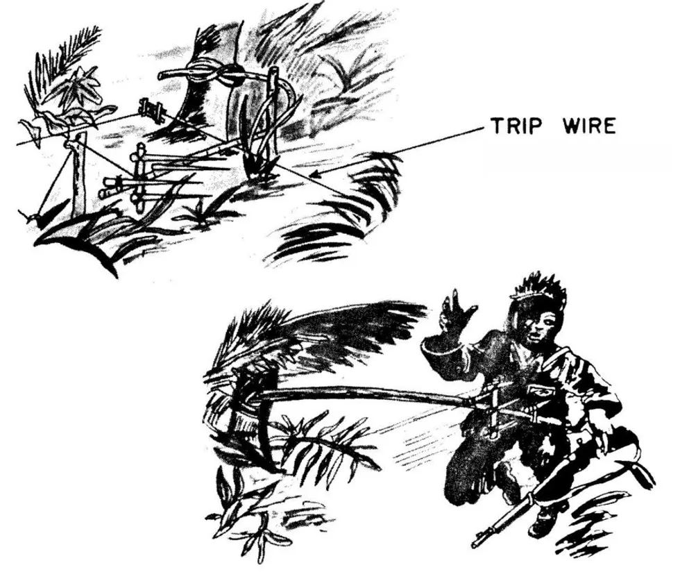
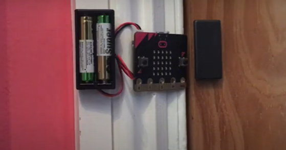
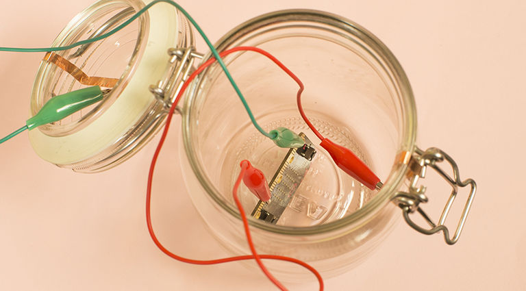
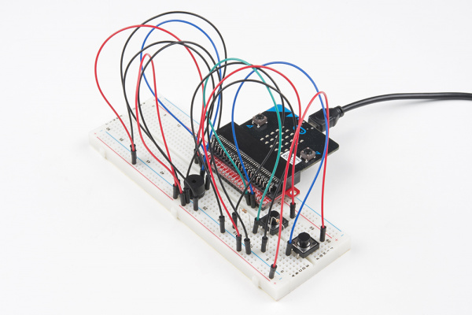
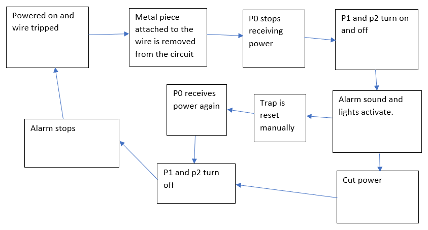
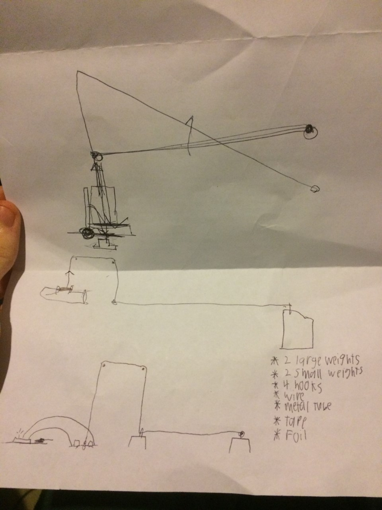
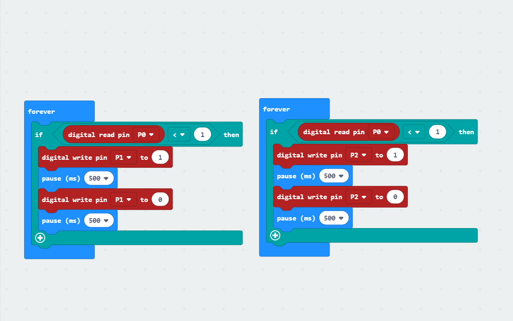

# 1701QCA Final project journal: Benjamin Davis

## Related projects ##

### Grenade-in-a-can ###

two following projects(https://www.wearethemighty.com/articles/8-of-the-most-terrifying-vietnam-war-booby-traps)

tripwires are a fairly common trap, as such there are many examples of different tripwires. The first two examples are of real life tripwire traps used during the Vietnam war. This example is a common and simple tripwire trap that uses a cord tied to the pin of a grenade within a can. once the wire is tripped the pin is pulled out and the grenade explodes.

### Bamboo Whip ###

the second trap is a more complex example of a tripwire trap. It involves a bamboo pole with a mace or spikes attatched to the end, that, when the wire is tripped, the pole will be released, sending the mace swinging into the victim.

### door alarm ###

Door alarm(https://www.microbit.org/news/2020-05-18/microbit-at-home-door-alarm/)

this project is a similar type of device to the tripwire that I'll be making. It's a home made door alarm that instead uses a magnet to detect when the microbit is away from the door.

### Timing gates ###

Timing gates(https://makecode.microbit.org/projects/timing-gates)

This project is also one that I have made for a previous assighnment as well. The construnction involves using tin foil to close a connection, then registering that in the microbit. The microbit then uses this info to find the speed of an object passing through the two points. This tripwire is similar in a couple of ways. Firstly this project also involves triggering something to happen after something goes past as well as having the trigger invole a piece of metal connecting two bits of tin foil.

### micro guardian ###

Micro guardian(https://make.techwillsaveus.com/microbit/activities/micro-guardian-advanced)

this is another similar project that involves a microbit that detects when a signal is no longer being recieved and triggers an alarm, just like this tripwire project. this example uses two bits of copper attatched to a jar and its lid.

### using a buzzer ###

Piezo tutorial(https://learn.sparkfun.com/tutorials/sparkfun-inventors-kit-for-microbit-experiment-guide/experiment-9-using-a-buzzer)

this is a basic project that shows the basics of using a piezo buzzer.

## Other research ##
I did not use too many outside tutorials outside of the instruction manual that came with th inventors kit. The manual was used to find out how to attatch the buzzer and light to the breadboard. Otherwise, help was recieved from other people, including friends and family, instructors and peers.

## Conceptual development ##

### Design intent ###
To make a tripwire activated device for a prank or practical joke.

### Design ideation ###
Ideas for tripwire:
1.	A tripwire that sprays water to keep pets away
2.	A tripwire that triggers an alarm with flashing lights
3.	A tripwire that screams when activated
4.	A tripwire that launches a soft projectile
The second option seems to be the most plausible option that fits the intent and would be possible given the resources.
Ideas for activation method:
1.	Standard wire
2.	Light sensor/laser pointer
3.	Motion camera
The light sensor would be difficult as the tools available are to imprecise to make it work. I do not have access to a motion sensing device so the last option is also not possible. This leaves the first solution as the only plausible option.
While a simple wire activating an alarm may seem basic and easy, the complexity will come mostly from how the wire activates the device. There are multiple ways even a wire activated mechanism can be executed. For example:
1.	Wire tilts microbit
2.	Wire disconnects a circuit
3.	Wire pulls a switch
4.	Wire pulls something onto a button
I figured the easiest and most interesting method would be the second method. The idea is to have one end of the wire pinned to a weight and the other end of the wire strung over a hook and tied to a piece of metal. The metal will connect two parts of a circuit and once the piece of metal is lifted the microbit will stop receiving a current and this will trigger the alarms.

### Final design concept ###
The final idea I came up with was to have a simple tripwire that activates and alarm with a red flashing light. the wire will be tied around a brick, suspended across the doorway and thread through a hook, drilled into the second brick. the wire is then hooked around another hook drilled into the wall above. on the other end of the wire will be a piece of metal. the microbit will be set up and two wires, that are part of a basic circuit, will be stuck into two peices of tin foil, wrapped around oppisite ends of a piece of cardboard. the piece of metal on the wire will be placed onto the piece of cardboard, so that it closes the circuit and a weight will be placed on top of the metal to keep the wire taut. The settup of the tripwire is more important than what the tripwire activates. The way it's set up is also important to the effectiveness of the practicle joke. the way it's set up is fairly complex, so only the person who set it up would be able to easily know how to set it up, and since it is triggered by not detecting a current, the only way to deactivate it is too set it up or cut the power completely.

### Interaction flowchart ###

## Process documentation ##

Alot of the documentation is part of the ideation process above

As the process of making the tripwire function was quite difficult and require specific equiptment and tools that required a precise time and place to access, I did not risk making many early concepts untill i was absolutely sure of the desighn.

the project went through a number of changes and updates before deciding on the final design and after the ideation. the ideas are displayed in the sketch bellow. some of the ideas included having the piece of metal pulled out of a clip and having a weight blocking a gate that would close the curcuit.

https://youtu.be/8w8tV6yB2MA

## Final code ##

basic.forever(function () {
    if (pins.digitalReadPin(DigitalPin.P1) < 1) {
        pins.digitalWritePin(DigitalPin.P0, 1)
        basic.pause(500)
        pins.digitalWritePin(DigitalPin.P0, 0)
        basic.pause(500)
    }
})
basic.forever(function () {
    if (pins.digitalReadPin(DigitalPin.P1) < 1) {
        pins.digitalWritePin(DigitalPin.P2, 1)
        basic.pause(500)
        pins.digitalWritePin(DigitalPin.P2, 0)
        basic.pause(500)
    }
})
basic.forever(function () {
    pins.digitalWritePin(DigitalPin.P3, 1)
})

## Design process discussion ##
This project went through a few minor updates. most of them have been discussed already. the main limitations i had were to do with the microbit. having to use the microbit meant i could not do anything that was outside of the microbits capaabilities, given what i had to work with. As such, I also could not make an entirely physically activated and resulting project.

## Reflection ##

I was proud of how the tripwire turned out, dispite how many alterations i had to make. I was very interested in making a tripwire type of mechanism. Although, this determination did also limit the options I had and I may have handicapped myself out of making a more fitting project for this assessment.

As i mentioned earlier, I only really used the sources to find out about how to attatch things to the breadboard safely.

The tripwires novelty comes from the unique way it is set up. The way it's set up is also important to the effectiveness of the practicle joke. the way it's set up is fairly complex, so only the person who set it up would be able to easily know how to set it up, and since it is triggered by not detecting a current, the only way to deactivate it is too set it up or cut the power completely.

An interesting extension to this project may be to see what other methods I could use to activate the alarm.
